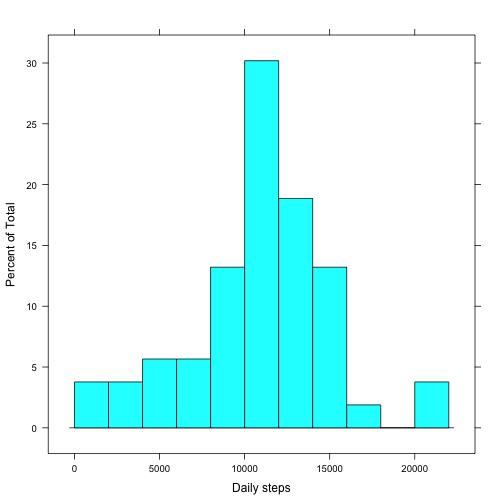
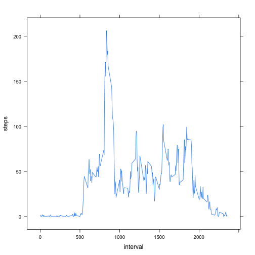
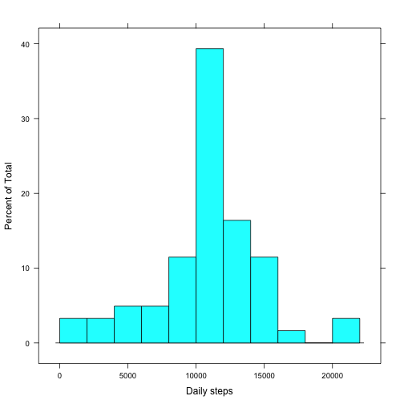

# Reproducible Research: Peer Assessment 1


## Loading and preprocessing the data

```r
library(Defaults)

setDefaults('as.Date.character', format = '%Y-%m-%d')

activity <- read.csv(file='activity.csv', header=TRUE, 
                     colClasses = c("numeric","Date","numeric"))
activity.complete_cases <- activity[complete.cases(activity),]
```

## What is mean total number of steps taken per day?

```r
library(lattice)
library(plyr)

activity.complete_cases.daily <- ddply(activity.complete_cases, .(date), 
                        summarize, steps=sum(steps))
histogram(activity.complete_cases.daily$steps, breaks=15, xlab="Daily steps")
```

 

### Mean and median daily steps (complete cases)

```r
mean(activity.complete_cases.daily$steps)
```

```
## [1] 10766
```

```r
median(activity.complete_cases.daily$steps)
```

```
## [1] 10765
```

## What is the average daily activity pattern?

```r
activity.complete_cases.daily_average <- ddply(activity.complete_cases, 
                                               .(interval), summarize, 
                                               steps=mean(steps))
xyplot(steps ~ interval , data=activity.complete_cases.daily_average, type="l")
```

 

### Which 5-minute interval, on average across all the days in the dataset, 
### contains the maximum number of steps?


```r
activity.complete_cases.daily_average[which.max(
  activity.complete_cases.daily_average$steps),]
```

```
##     interval steps
## 104      835 206.2
```

## Imputing missing values
### Total missing values

```r
sum(is.na(activity$steps))
```

```
## [1] 2304
```

We can replace the missing values with the daily interval averages which are 
already available.

```r
activity.missing <- activity[is.na(activity$steps),]
activity.missing$steps <- activity.complete_cases.daily_average$steps[
  match(activity.missing$interval, 
        activity.complete_cases.daily_average$interval)]

activity$steps <- ifelse(is.na(activity$steps), activity.missing$steps, 
                         activity$steps)

activity.daily <- ddply(activity, .(date), summarize, steps=sum(steps))

histogram(activity.daily$steps, breaks=15, xlab="Daily steps")
```

 

### Mean and median daily steps (imputed)

```r
mean(activity.daily$steps)
```

```
## [1] 10766
```

```r
median(activity.daily$steps)
```

```
## [1] 10766
```
Replacing the missing values with the daily interval averages had essentially no 
effect on mean and median. This makes sense since we replace the NA's with 
computed averages. 

## Are there differences in activity patterns between weekdays and weekends?

```r
activity$daytype <- ifelse(weekdays(activity$date) %in% c("Saturday", "Sunday"),
                           "weekend", "weekday")
activity.daytype <- ddply(activity, .(daytype, interval), summarise, 
                          steps=mean(steps))
xyplot(steps ~ interval | daytype, data=activity.daytype, type="l", 
       layout=c(1, 2))
```

 

The avergae steps taken per interval is higher on weekends compared to weekdays. 
Additionally the activities are more distributed scross the day - seems like 
people are generally active during the weekends.


